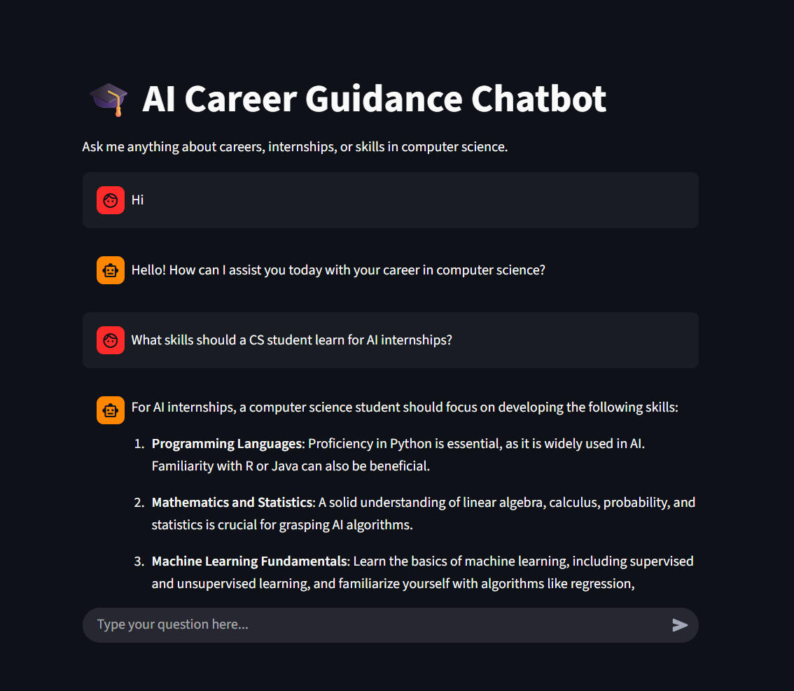

# AI Chatbot for CS Career Guidance

A Python-based AI chatbot that provides career guidance, internship advice, and skill recommendations for computer science students. It uses Streamlit for the interface and OpenAI’s GPT models for AI responses.

## Technologies Used

- Python
- Streamlit
- OpenAI API
- Python-dotenv

## Key Features

- Interactive chat interface
- Maintains conversation context
- Provides practical career guidance

## Usage

Clone the repository:
```bash
git clone https://github.com/Intechgent/ai-chatbot-python.git
```
 Use `streamlit run app.py` in the terminal to launch the chatbot interface in your browser.

## Screenshot



> Note that:
> This project requires an OpenAI API key.
> You must create a `.env` file and add your own API key before running the app.
> The chatbot will not work without a valid API key.
